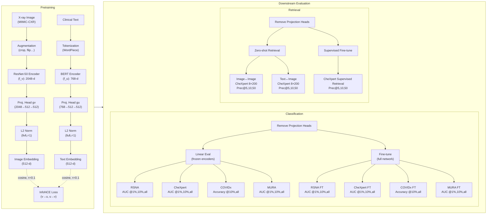

# ConVIRT Implementation with PyHealth

The repository has an implementation of the ConVIRT (Contrastive Visual Representation Learning from Text) model using [PyHealth library](https://pyhealth.readthedocs.io/en/latest/). ConVIRT is a contrastive learning framework for learning medical visual representations from paired medical images and reports.

# Pipeline

## Requirements

- Python 3.7+
- PyTorch 1.7+
- torchvision
- transformers
- PyHealth
- scikit-learn
- pandas
- numpy
- tqdm
- matplotlib

# Datasets
## Download URL
| Dataset | Download URL |
|--------------|-----------------------------------------------------------------|
| MIMIC-CXR-JPG | https://physionet.org/content/mimic-cxr-jpg/2.1.0/ |
| RSNA | https://kaggle.com/competitions/rsna-pneumonia-detection-challenge/ |
| Chexpert | https://stanfordmlgroup.github.io/competitions/chexpert/ |
| COVIDx | https://kaggle.com/datasets/andyczhao/covidx-cxr2 |
| MURA | https://stanfordmlgroup.github.io/competitions/mura/ |

## Comprehensive Statistics of Medical Imaging Datasets

| Characteristic | MIMIC-CXR-JPG | RSNA | CheXpert | COVIDx | MURA |
|----------------|---------------|------|----------|--------|------|
| **Purpose** | Pretraining | Evaluation | Evaluation | Evaluation | Evaluation |
| **Image Type** | Chest X-rays | Chest X-rays | Chest X-rays | Chest X-rays | Musculoskeletal X-rays |
| **Total Images/Pairs** | ~217,000 pairs | ~26,000 images | ~224,000 images | ~14,000 images | ~40,000 images |
| **Task Type** | Contrastive Learning | Binary Classification | Multi-label Binary Classification | Multi-class Classification | Binary Classification |
| **Classes/Labels** | N/A (Paired text) | Normal vs Pneumonia | 5 conditions: Atelectasis, Cardiomegaly, Consolidation, Edema, Pleural Effusion | COVID-19, non-COVID pneumonia, normal | Normal vs Abnormal |
| **Training Split** | ~212,000 pairs | 25,184 images | 218,414 images | 13,598 images | 33,078 images |
| **Validation Split** | ~5,000 pairs | 1,500 images | 5,000 images | 300 images | 3,730 images |
| **Test Split** | N/A | 3,000 images | 234 images (expert-labeled) | 300 images | 3,197 images |
| **Class Distribution** | N/A | ~73% normal, ~27% pneumonia | Atelectasis: 11.8% Cardiomegaly: 9.1% Consolidation: 3.8% Edema: 4.5% Pleural Effusion: 7.9% | COVID-19: ~3% Pneumonia: ~43% Normal: ~54% | Normal: 36.7% Abnormal: 63.3% |
| **File Format** | JPG | DICOM | JPG | PNG/JPG | PNG |
| **Avg. Images per Study** | 1.7 | 1 | 1 | 1 | 2.7 |
| **Text Characteristics** | ~6.0 sentences per report | N/A | N/A | N/A | N/A |
| **Additional Notes** | Used for contrastive pretraining | Patient-level labels | Uncertain labels (-1) handled as negatives | Highly imbalanced (few COVID cases) | 7 body parts (Wrist: 27.1%, Hand: 20.8%, Elbow: 15.7%, Shoulder: 14.9%, Finger: 7.7%, Forearm: 7.3%, Humerus: 6.5%) |
| **Original Source** | Johnson et al., 2019 | Wang et al., 2017; Shih et al., 2019 | Irvin et al., 2019 | Wang and Wong, 2020 | Rajpurkar et al., 2018 |

## Model Architecture

The ConVIRT model consists of the following components:

1. **Image Encoder**: A ResNet-50 model pretrained on ImageNet.
2. **Text Encoder**: A Clinical BERT model for encoding medical reports.
3. **Projection Heads**: MLPs that project the image and text features to a common embedding space.
4. **Contrastive Loss**: A bidirectional contrastive loss function that aligns paired images and text in the embedding space.

## Citation

[The original ConVIRT paper](https://arxiv.org/abs/2010.00747)
